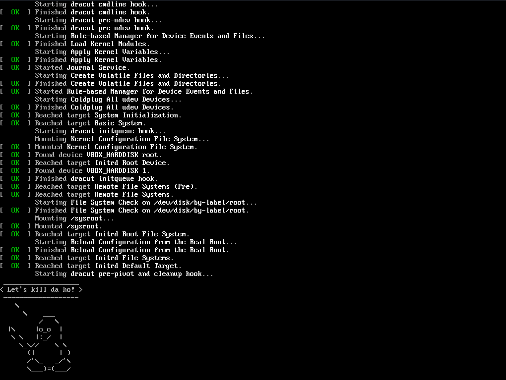

# Первая лабораторная работа

## Описание

В данной лабораторной работе демонстрируется модуль для dracut,
который при установке будет выводить картинку пингвинчика
и задерживать запуск системы на 10 секунд
в целях наглядной демонстрации этого пингвинчика при запуске.

## Установка

Дисклеймер. Используется операционная система Archlinux,
развёрнутый в VirtualBox.

Для установки необходимо поместить `module-setup.sh` в `modules.d`:

```bash
cp -r ./01test /usr/lib/dracut/modules.d/
```

И сгенерировать initramfs:

```bash
dracut /boot/killdaho.img
```

Ещё нужно указать загрузчику (например, systemd-boot) путь на новый initramfs:

```bash
tee /boot/loader/entries/killdaho.conf <<'EOF'
title           Kill Da Ho!
linux           /vmlinuz-linux
initrd          /killdaho.img
options         root=LABEL=root rw
EOF
```

## Результат

Перезагружаемся:

```bash
reboot
```

И видим результат.



## Источники

- [Archwiki](https://wiki.archlinux.org/index.php/Dracut#Usage)
- [Dracut man page](https://linux.die.net/man/8/dracut)
